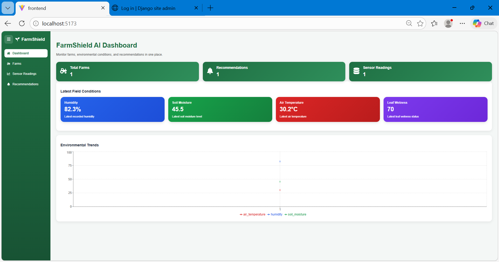
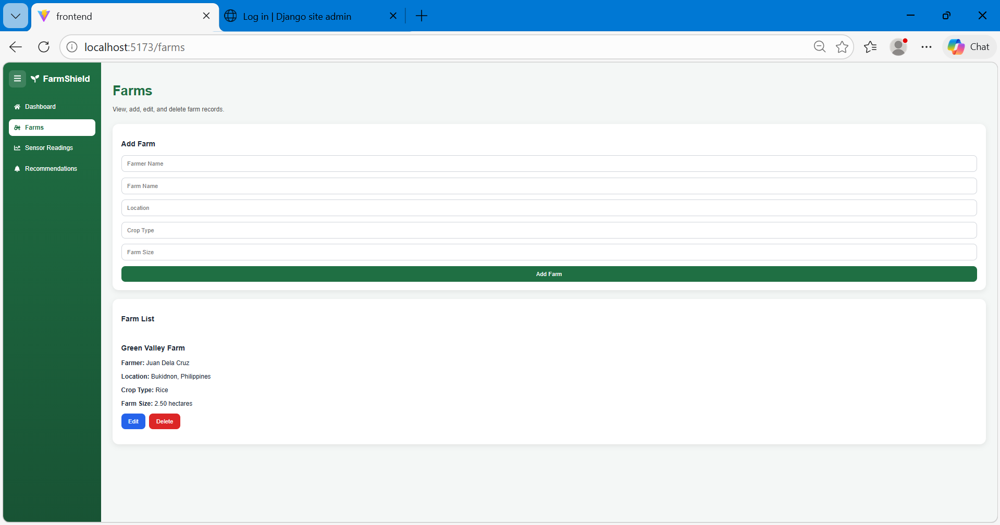
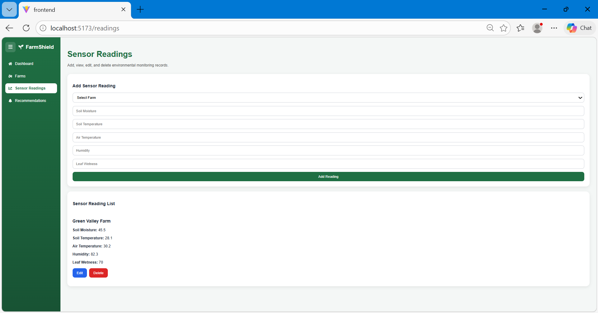
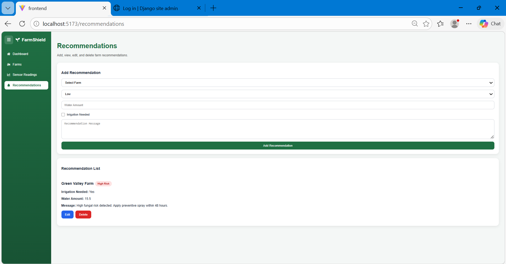
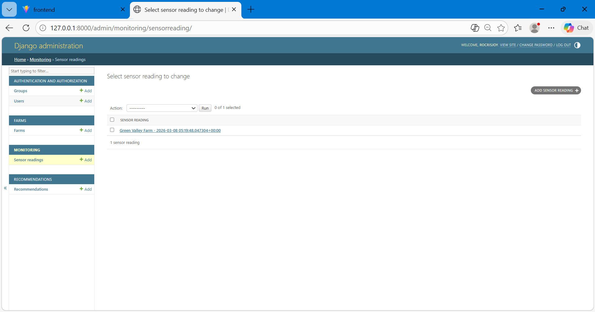

# FarmShield AI: Agricultural Monitoring & Predictive System

## 1. Startup Narrative
**FarmShield AI** is a full-stack agritech solution designed to empower farmers by modernizing field monitoring. By leveraging IoT data, the system provides real-time insights into environmental conditions to help prevent pests and crop diseases. The platform aims to make farming more efficient, productive, and resilient against environmental risks through data-driven decision-making.

---

## 2. System Screenshots & Documentation
This section provides visual documentation of the FarmShield AI interface, ranging from dashboard analytics to administrative backend controls.

### A. FarmShield AI Dashboard
The central monitoring hub where farmers can view the overall status of their farm, including environmental trends through visual data charts.

### B. Farm Management Interface
This interface allows for the management of farm records, including farmer details, location, crop type, and land size to ensure accurate data categorization.

### C. Environmental Sensor Readings
Displays live data transmissions from field sensors, including Soil Moisture, Temperature, Humidity, and Leaf Wetness.

### D. Automated Agricultural Recommendations
Based on sensor data, the system generates AI recommendations, such as irrigation requirements or alerts for fungal risks, allowing for immediate action.

---

## 3. Administrative Backend (Django REST Framework)
The backend utilizes the Django Administration interface to ensure secure management of API endpoints, database records, and system-wide business logic.

### A. Backend Farm Management
Centralized organization of all farm locations and assets. This allows administrators to audit and manage geographical data across the system.

### B. Backend Monitoring Records
Historical tracking of all sensor telemetry. This interface allows for the manual review of raw data logs to ensure hardware accuracy.

### C. Backend Recommendation Logic
Management of the automated logic-based alerts. Administrators can review the parameters that trigger high-risk fungal or irrigation warnings.

---

## 4. Technical Stack
* **Frontend**: React + Vite, Axios, Recharts (for data visualization)
* **Backend**: Django REST Framework (DRF)
* **Database**: SQLite3
* **Key Features**: Full CRUD Operations, Real-time Sensor Monitoring, AI Recommendation Engine

---

## 5. 🚀 How to Run the Project

### Backend Setup
1. Navigate to the backend folder: `cd backend`
2. Activate the virtual environment: `venv\Scripts\activate`
3. Start the server: `python manage.py runserver`
   * *Running at: http://127.0.0.1:8000*

### Frontend Setup
1. Navigate to the frontend folder: `cd frontend`
2. Install dependencies: `npm install`
3. Start the development server: `npm run dev`
   * *Running at: http://localhost:5173*